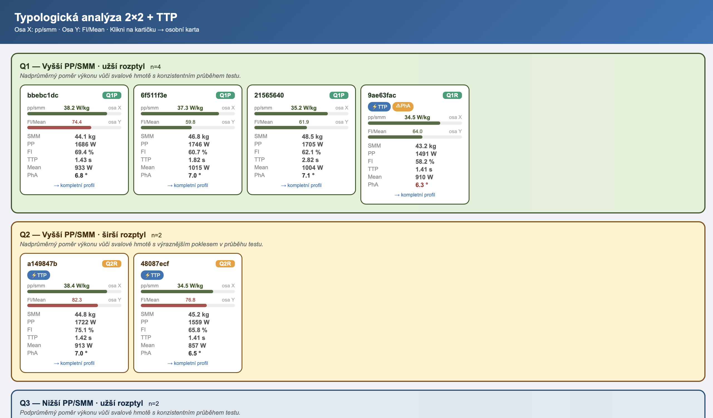
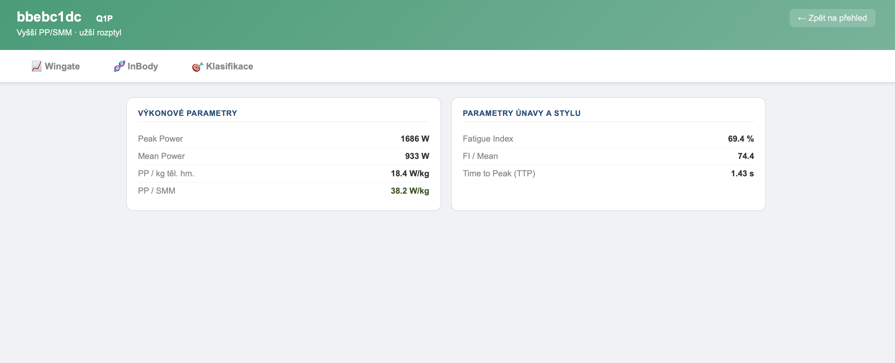
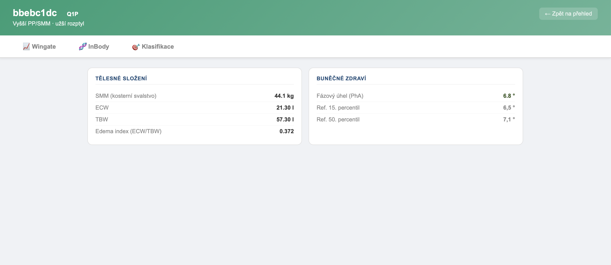
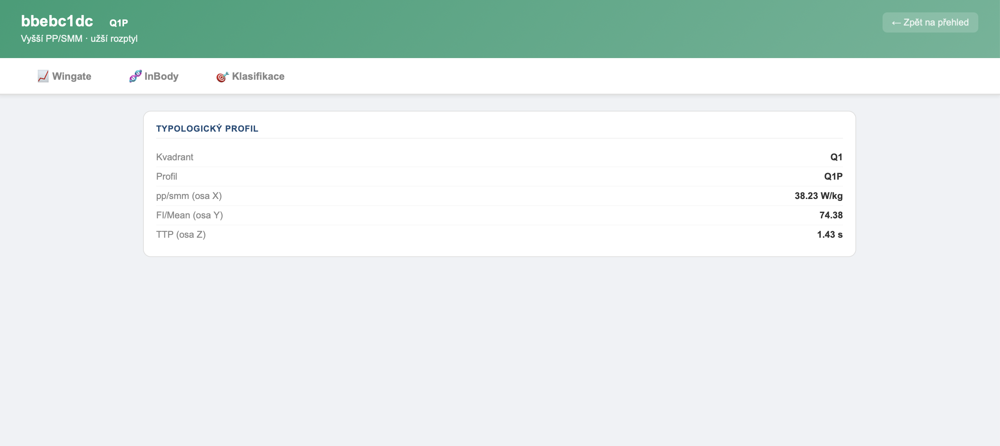

# Athlete Classifier — Typological Analysis 2×2 + TTP

> **EN** | [🇨🇿 Česká verze níže](#česká-verze)

A Spring Boot web application that classifies athletes based on anaerobic performance data (Wingate test) and body composition (BIA). Built as a Java demonstration of the classification pipeline developed in my master's thesis at Masaryk University.

---

## What it does

The app loads athlete diagnostic data into an in-memory H2 database, runs a three-dimensional typological classification, and presents results as interactive player cards with drill-down detail views.

**Classification axes:**
- **Axis X — pp/smm** · Peak Power relative to skeletal muscle mass (W/kg)
- **Axis Y — FI/Mean** · Fatigue Index normalized to mean power (performance curve shape)
- **Axis Z — TTP** · Time to Peak Power (rapid R vs. progressive P onset)

Athletes are assigned to one of eight profiles (Q1R–Q4P).

---

## Screenshots

### Team overview — player cards by quadrant


### Player detail — Wingate tab


### Player detail — InBody tab


### Player detail — Classification tab


---

## Tech stack

| Layer | Technology |
|---|---|
| Backend | Java 21, Spring Boot 3.3, Spring Data JPA |
| Database | H2 (in-memory) |
| Frontend | Thymeleaf, HTML/CSS |
| Build | Maven |

---

## How to run

**Prerequisites:** Java 21+, Maven (included via `mvnw`)

```bash
git clone https://github.com/TommiBu/athlete-classifier.git
cd athlete-classifier
./mvnw spring-boot:run
```

Open `http://localhost:8080` in your browser.

The app seeds 12 synthetic hockey players on startup — no database setup required.

---

## How it connects to the full project

This repo is a Java demonstration of the classification logic originally developed in Python as part of my master's thesis pipeline. The full Python pipeline (BIA + Wingate integration, synthetic data generation, interactive HTML report) lives in the private repository.

---

---

## Česká verze

> [🇬🇧 English version above](#athlete-classifier--typological-analysis-22--ttp)

Spring Boot webová aplikace která klasifikuje sportovce na základě dat z anaerobního výkonu (Wingate test) a tělesného složení (BIA). Vznikla jako Java demonstrace klasifikační pipeline vyvinuté v rámci diplomové práce na Masarykově univerzitě.

---

## Co aplikace dělá

Aplikace načte diagnostická data sportovců do in-memory H2 databáze, provede trojdimenzionální typologickou klasifikaci a výsledky prezentuje jako interaktivní kartičky hráčů s detailními profily.

**Osy klasifikace:**
- **Osa X — pp/smm** · Maximální výkon vůči kosterní svalové hmotě (W/kg)
- **Osa Y — FI/Mean** · Index únavy normalizovaný na průměrný výkon (tvar výkonové křivky)
- **Osa Z — TTP** · Čas do maxima (rychlý nástup R vs. pozvolný nástup P)

Každý hráč je zařazen do jednoho z osmi profilů (Q1R–Q4P).

---

## Tech stack

| Vrstva | Technologie |
|---|---|
| Backend | Java 21, Spring Boot 3.3, Spring Data JPA |
| Databáze | H2 (in-memory) |
| Frontend | Thymeleaf, HTML/CSS |
| Build | Maven |

---

## Jak spustit

**Požadavky:** Java 21+, Maven (součástí repozitáře přes `mvnw`)

```bash
git clone https://github.com/TommiBu/athlete-classifier.git
cd athlete-classifier
./mvnw spring-boot:run
```

Otevřete `http://localhost:8080` v prohlížeči.

Aplikace při startu automaticky naplní databázi 12 syntetickými hokejisty — žádné nastavení databáze není potřeba.

---

## Návaznost na hlavní projekt

Toto repo je Java demonstrace klasifikační logiky, která byla původně vyvinuta v Pythonu jako součást pipeline k diplomové práci. Kompletní Python pipeline (integrace BIA + Wingate, generování syntetických dat, interaktivní HTML report) je v privátním repozitáři.

---

